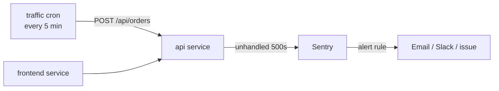

# Production Alert Demo (Railway + Sentry)

This demo runs OctoCAT Supply in production on Railway. A real bug in order creation fires a real Sentry alert.

## How it works



- **api**: the Express API. `api/src/instrument.ts` enables Sentry when `SENTRY_DSN` is set. 5xx errors are captured automatically with the request body and TypeScript stack frames.
- **frontend**: the storefront, pointed at the API's public domain.
- **traffic**: a cron job that runs `api/src/simulate-traffic.ts` to place orders for branches 1 and 2 every 5 minutes.

### The incident

Setting `INCIDENT=true` makes the traffic job send some orders from a newly opened branch. Those orders fail in production, and Sentry captures them as unhandled errors on `POST /api/orders`. Keep the diagnosis out of this repo, because the agent reads it during the demo.

The demo depends on the bug staying on `main`. Merge a fix only after the demo, or redeploy the old commit afterwards.

## One-time setup

### 1. Sentry

1. Create a Sentry project with the **Express** platform.
2. Copy its DSN from **Settings → Projects → (project) → Client Keys (DSN)**.
3. Under **Alerts**, create an issue alert for the `production` environment. Use one of these triggers:
   - **A new issue is created**, which fires on the first failure.
   - **Number of events in an issue is more than 5 in 5 minutes**, which reads more like a real incident.
4. Set the alert action. Use email or Slack, or connect the GitHub integration to create issues.

### 2. Railway

The `.railway/railway.ts` file defines the api, frontend, and traffic services. They deploy from `main` in `octodemo/octocat_supply`.

```bash
npm install -g @railway/cli
railway login
cd .railway && npm install && cd ..
railway init --name octocat-supply      # or `railway link` to an existing project
railway config apply
railway variables --service api --set "SENTRY_DSN=<your DSN>"
railway domain --service api
railway domain --service frontend
```

Railway needs access to `octodemo/octocat_supply` through the Railway GitHub App.

## Running the demo

1. **Before the demo**, check that the storefront loads and that `traffic` cron runs return `201`s.
2. **Start the incident** by setting this variable on the traffic service:

   ```bash
   railway variables --service traffic --set INCIDENT=true
   ```

   The next cron run, within 5 minutes, sends about a third of its orders from branch 3. To trigger it immediately from your machine, run:

   ```bash
   make demo-incident URL=https://<api-domain>
   ```

3. Sentry receives the errors and the alert fires.
4. **Reset after the demo:**

   ```bash
   railway variables --service traffic --set INCIDENT=false
   ```

   Resolve the Sentry issue so the next run alerts again.

## Local check without Railway

```bash
SENTRY_DSN=<dsn> SENTRY_ENVIRONMENT=demo-local make dev-api
make demo-incident
```

## Configuration

| Variable | Service | Purpose |
|---|---|---|
| `SENTRY_DSN` | api | Enables Sentry. Leave unset to disable. |
| `SENTRY_ENVIRONMENT` | api | Sentry environment. Defaults to `NODE_ENV`. |
| `SENTRY_RELEASE` | api | Release name. Defaults to `RAILWAY_GIT_COMMIT_SHA`. |
| `SENTRY_TRACES_SAMPLE_RATE` | api | Trace sample rate. Defaults to `1.0`. |
| `TARGET_URL` | traffic | API base URL. A bare domain defaults to `https`. |
| `ORDER_COUNT` | traffic | Orders per run. Defaults to `20`. |
| `INCIDENT` | traffic | Set to `true` to start the incident. |
| `INCIDENT_RATE` | traffic | Share of incident orders. Defaults to `0.35`. |
